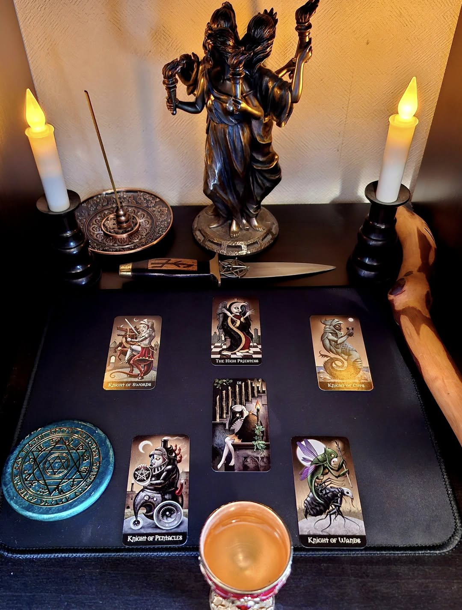

# ネガティブな影響を追い払う儀式_v01

## 🛡️ 概要

この儀式は、精神的・霊的に影響を及ぼすネガティブな力を追い払い、内外に守護の結界を張るためのプロトコルです。本棚神殿とタロットを用いて、六枚のカードを「守護と中核」の役割で展開し、ヘカテ女神に祈願します。

## 📆 適した時期

- 土曜日（保護・終息）
- 減少の月（waning moon）
- ネガティブな体験や不安が強い時期

## 🔮 用意するもの

- 本棚神殿
- 小型タロットデッキ（Deviant Moon Tarot や Universal Tarot 等）
- 電池式キャンドルまたは黒いキャンドル（安全なもの）
- お香、香炉（浄化を象徴するもの）

## 🃏 使用カードとその意味

| 番号 | 役割         | 一般タロットのカード           |
|------|--------------|----------------------------|
| 1    | 除去すべき影響 | Nine of Swords（ソードの9）     |
| 2    | 地の守護     | Knight of Pentacles（ペンタクルのナイト） |
| 3    | 霊的中核     | High Priestess（女教皇）         |
| 4    | 火の守護     | Knight of Wands（ワンドのナイト）     |
| 5    | 風の守護     | Knight of Swords（ソードのナイト）    |
| 6    | 水の守護     | Knight of Cups（カップのナイト）     |

## ✨ 儀式の流れ

1. 本棚神殿を整える。
2. 上記の6枚を儀式の中心に配置する
3. 香を焚き、ヘカテに祈願を開始する。
4. 以下の祈り（英語＋日本語）を唱える。
5. 数日間そのまま設置して、守護の結界を維持する。

## 🗺️ カード配置レイアウト

この儀式で使用するカードの配置は以下の通りです：

## 🕯️ 祈り（Invocation to Hekate for Banishing and Protection）

> O Hekate, Keeper of the Threshold,  
> She who sees through shadows,  
> Cleanse me of this burden,  
> And cast out the clawing night.  
> （門の番人ヘカテよ、  
> 影を見通すあなたよ、  
> この重荷を私から取り除き、  
> まとわりつく闇を追い払ってください。）

> Let the Knights stand watch:  
> Earth firm beneath me,  
> Fire bright before me,  
> Water still within me,  
> Wind sharp around me.  
> （ナイトたちよ、ここに立って見守れ：  
> 地は我が足元を堅くし、  
> 火は我が前方を照らし、  
> 水は我が内側を静め、  
> 風は我が周囲を切り払うように。）

> And above all,  
> High Priestess of silence and knowing—  
> Be my anchor,  
> And seal the gate behind me.  
> （そしてすべての上に、  
> 沈黙と知の女教皇よ——  
> 私の錨となり、  
> 背後の門を封じてください。）

> So mote it be.
> （そうあれかし）

## 🖼️ 写真による実例

### 使用例：Deviant Moon Tarot  

### 参考例：Universal Tarot  

## 📚 参考文献

このプロトコルは、チック・シセロとサンドラ・タバサ・シセロによる『タロット・タリスマン』をベースに再構成されています。
Open Source Witchcraftプロジェクトの一環として、本棚神殿と現代的なツールによるオープンソース魔術として設計されています。

## 🔓 ライセンス

本プロトコルは非商用・改変自由・クレジット表記のもと、Creative Commons BY 4.0にて公開されています。
